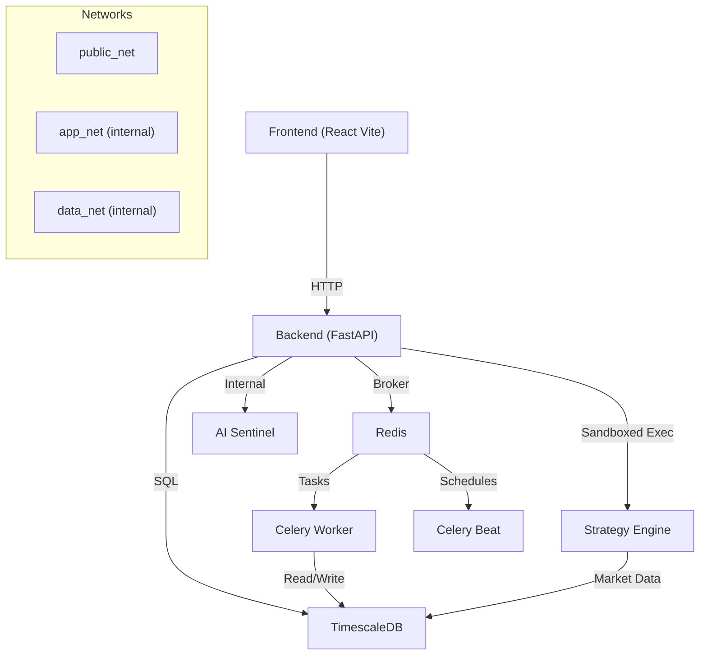

# Autarkic Trading Platform

Production-grade, multi-service trading platform with a React 19 frontend, FastAPI backend, TimescaleDB ledger, Redis, Celery background jobs, a sandboxed strategy engine, and an isolated AI sentinel service. This repository is prepared for open-source collaboration and excludes all personal, local-only artifacts.

## Status Quo

- Core microservices are wired via Docker Compose with isolated networks.
- Trading agent lifecycle and fleet management are implemented in the backend.
- Strategy execution runs in a sandboxed service.
- Frontend provides the Fleet dashboard and charting UI.
- Background jobs collect OHLCV data and clean old records.

### Current Capabilities (Highlights)

- Agent lifecycle: PAUSED -> SCANNING -> PROPOSING -> AWAITING_APPROVAL -> ACTIVE -> IN_POSITION -> COOLDOWN
- Fleet manager: registry of active agents, budget locking, and status broadcasting
- Strategy execution: Python sandbox with restricted imports (pandas/numpy only)
- Market data: OHLCV caching with retention policies by timeframe
- Background jobs: scheduled cleanup of logs and candles via Celery Beat

## Tech Stack (Current)

### Frontend
- React 19 + Vite
- TailwindCSS
- Zustand
- KlineCharts + Lightweight Charts + D3
- React Router

### Backend
- FastAPI + Uvicorn
- SQLAlchemy (async)
- Celery + Redis
- CCXT (exchange integration)
- pandas + numpy

### Data
- TimescaleDB (PostgreSQL 15)
- Redis (cache + broker)

### Services
- strategy-engine: sandboxed Python execution for strategies
- ai-sentinel: isolated AI analysis service

## Architecture Diagram



## Repository Layout (High Level)

- `frontend/` React UI (Vite)
- `backend/` FastAPI + Celery + DB models
- `strategy-engine/` sandboxed strategy execution
- `ai-sentinel/` isolated AI analysis service
- `infra/` Docker Compose and secrets
- `market-gateway/` exchange gateway components

## Requirements

- Docker Desktop (or compatible Docker Engine)
- Docker Compose

## Quick Start (Docker)

1. Ensure the database password secret exists:
   - `infra/secrets/db_password.txt`

2. Start the stack:

```bash
cd infra
docker compose up -d --build
```

3. Open the UI:

- Frontend: http://localhost:5173
- Backend:  http://localhost:8000
- Strategy Engine: http://localhost:8001

## Local Development (Without Docker)

This mode is intended for contributors who want to run services directly on their machine.

### Prerequisites

- Python 3.11+
- Node.js 20+
- PostgreSQL 15 (TimescaleDB recommended)
- Redis

### Backend

```bash
# Autarkic Trading Platform

Autarkic Trading Platform is a production-grade, multi-service trading system with a React 19 frontend, FastAPI backend, TimescaleDB ledger, Redis, Celery background jobs, a sandboxed strategy engine, and an isolated AI sentinel service. The repository is prepared for open-source collaboration and excludes all local-only artifacts.

## Table of Contents

- Overview
- Architecture
- Service Map
- Core Flows
- Tech Stack
- Data Model (Key Tables)
- API Surface (High-Level)
- Quick Start (Docker)
- Local Development (Without Docker)
- Configuration and Secrets
- Observability and Troubleshooting
- Contributing
- Roadmap
- License

## Overview

The platform orchestrates autonomous trading agents that analyze multi-timeframe market data, generate proposals, and execute trades only after explicit approval. It combines strict network isolation with a sandboxed strategy execution model and a centralized fleet manager.

### Current Capabilities (Highlights)

- Agent lifecycle: PAUSED -> SCANNING -> PROPOSING -> AWAITING_APPROVAL -> ACTIVE -> IN_POSITION -> COOLDOWN
- Fleet manager: registry of active agents, budget locking, and status broadcasting
- Strategy execution: Python sandbox with restricted imports (pandas/numpy only)
- Market data: OHLCV caching with retention policies by timeframe
- Background jobs: scheduled cleanup of logs and candles via Celery Beat

## Architecture

```mermaid
graph TD
  UI[Frontend (React/Vite)] -->|HTTP| API[Backend (FastAPI)]
  API -->|SQL| DB[TimescaleDB]
  API -->|Broker| R[Redis]
  API -->|Sandboxed Exec| SE[Strategy Engine]
  R -->|Tasks| CW[Celery Worker]
  R -->|Schedules| CB[Celery Beat]
  CW -->|Read/Write| DB
  SE -->|Market Data| DB
  API -->|Internal| AS[AI Sentinel]

  subgraph Networks
    PN[public_net]
    AN[app_net (internal)]
    DN[data_net (internal)]
  end
```

## Service Map

| Service | Port | Purpose | Network |
| --- | --- | --- | --- |
| frontend | 5173 | React UI and charts | public_net, app_net |
| backend | 8000 | API, agent orchestration | public_net, app_net, data_net |
| strategy-engine | 8001 | Sandboxed strategy execution | app_net, data_net |
| ai-sentinel | - | AI analysis (isolated) | app_net |
| ledger-db | - | TimescaleDB ledger | data_net |
| redis | - | Cache + broker | app_net, data_net |
| celery_worker | - | Background tasks | app_net, data_net |
| celery_beat | - | Scheduled tasks | app_net |

## Core Flows

### Agent Lifecycle

1. Fetch macro (4h) and micro (15m) data
2. Execute strategy code in sandboxed namespace
3. Synthesize signals and generate proposal with risk markers
4. Await user approval
5. Execute trade, monitor position, then cooldown

### Market Data and Retention

- OHLCV data is cached by timeframe with retention policies per timeframe
- Celery Beat schedules collection and cleanup tasks

### Strategy Execution

- User strategy code is transpiled to Python and executed in the strategy engine
- Only pandas and numpy are available in the sandbox

### Fleet Updates

- Fleet manager emits updates via Redis channels
- UI consumes and renders real-time status changes

## Tech Stack (Current)

### Frontend

- React 19 + Vite
- TailwindCSS
- Zustand
- KlineCharts + Lightweight Charts + D3
- React Router

### Backend

- FastAPI + Uvicorn
- SQLAlchemy (async)
- Celery + Redis
- CCXT (exchange integration)
- pandas + numpy

### Data

- TimescaleDB (PostgreSQL 15)
- Redis (cache + broker)

### Services

- strategy-engine: sandboxed Python execution for strategies
- ai-sentinel: isolated AI analysis service

## Data Model (Key Tables)

The database contains core entities for agents, market data, and paper trading. Key tables include:

- TradingAgent (budget, status, leverage, lifecycle)
- AgentLog (high-frequency logs, cleaned hourly by Celery)
- OHLCVCache (time-series market data with retention)
- PaperAccount, PaperPosition, PaperOrder, PaperTrade (paper trading simulation)
- Strategy (Pine Script and generated Python code)

## API Surface (High-Level)

Base URL: `http://localhost:8000`

- `GET /health` health check
- `GET /api/v1/openapi.json` OpenAPI schema

Primary routers:

- `/api/v1/auth`
- `/api/v1/users`
- `/api/v1/settings`
- `/api/v1/strategies`
- `/api/v1/market`
- `/api/v1/trade`
- `/api/v1/paper`
- `/api/v1/fleet`
- `/api/v1/fleet/ws`
- `/api/v1/history`
- `/api/v1/ai`
- `/api/v1/ai-strategy`
- `/api/v1/research`

Example requests:

```bash
curl http://localhost:8000/health
```

```bash
curl http://localhost:8000/api/v1/strategies
```

```bash
curl http://localhost:8000/api/v1/fleet
```

## Quick Start (Docker)

### Requirements

- Docker Desktop (or compatible Docker Engine)
- Docker Compose

### Steps

1. Ensure the database password secret exists:
   - `infra/secrets/db_password.txt`

2. Start the stack:

```bash
cd infra
docker compose up -d --build
```

3. Open the UI:

- Frontend: http://localhost:5173
- Backend:  http://localhost:8000
- Strategy Engine: http://localhost:8001

## Local Development (Without Docker)

This mode is intended for contributors who want to run services directly on their machine.

### Prerequisites

- Python 3.11+
- Node.js 20+
- PostgreSQL 15 (TimescaleDB recommended)
- Redis

### Backend

```bash
cd backend
python -m venv .venv
source .venv/bin/activate
pip install -r requirements.txt
uvicorn app.main:app --reload --host 0.0.0.0 --port 8000
```

### Celery

```bash
cd backend
source .venv/bin/activate
celery -A app.core.celery_app worker --loglevel=info
celery -A app.core.celery_app beat --loglevel=info
```

### Strategy Engine

```bash
cd strategy-engine
python -m venv .venv
source .venv/bin/activate
pip install -r requirements.txt
uvicorn app.main:app --reload --host 0.0.0.0 --port 8001
```

### Frontend

```bash
cd frontend
npm install
npm run dev
```

## Configuration and Secrets

### Docker

The compose file uses a Docker secret for the DB password:

- `infra/secrets/db_password.txt`

Key environment variables (examples):

```bash
POSTGRES_SERVER=ledger-db
POSTGRES_DB=trading_db
CELERY_BROKER_URL=redis://redis:6379/0
REDIS_URL=redis://redis:6379/0
```

### Local

Set your local environment variables in your shell or a private `.env` file.

## Observability and Troubleshooting

```bash
docker logs backend
docker logs celery_worker
docker logs celery_beat
docker logs frontend
```

```bash
curl http://localhost:8000/health
```

## Security and Data Hygiene

This repository intentionally excludes local-only artifacts (session notes, credentials, workspace files, debug scripts, and personal research). See `.gitignore` for details.

## Contributing

1. Fork the repository and create a feature branch.
2. Keep changes focused and include context in the commit message.
3. Ensure Docker builds and the stack starts via `infra/docker-compose.yml`.
4. Open a PR with a short summary, test notes, and screenshots (frontend changes).

## Roadmap (High-Level)

- Hardened auth and role-based access for multi-user deployments
- Extended strategy SDK and backtest workflow
- Live trading connectors beyond Bitget
- Observability: structured tracing and metrics across services
- Public API documentation and SDK examples

## License

MIT
